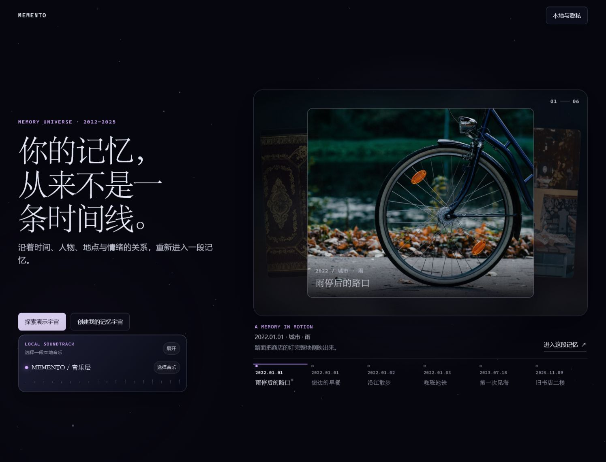
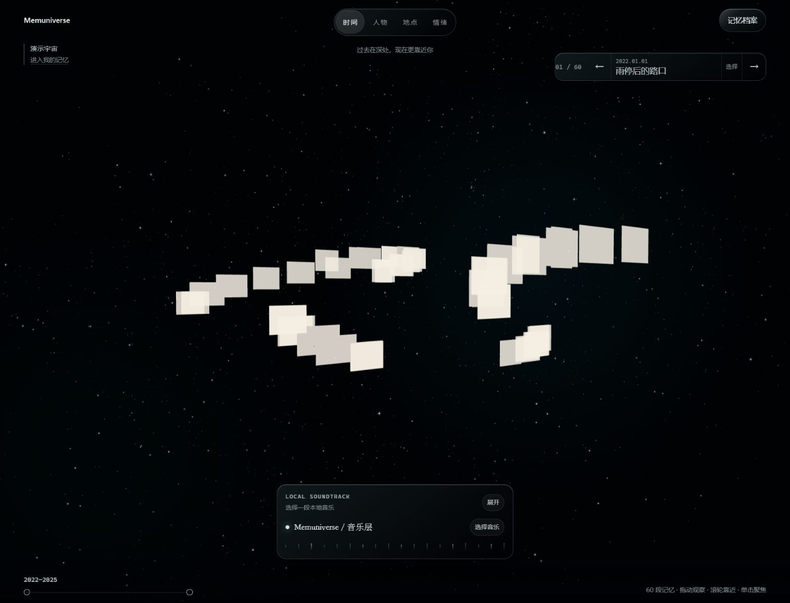
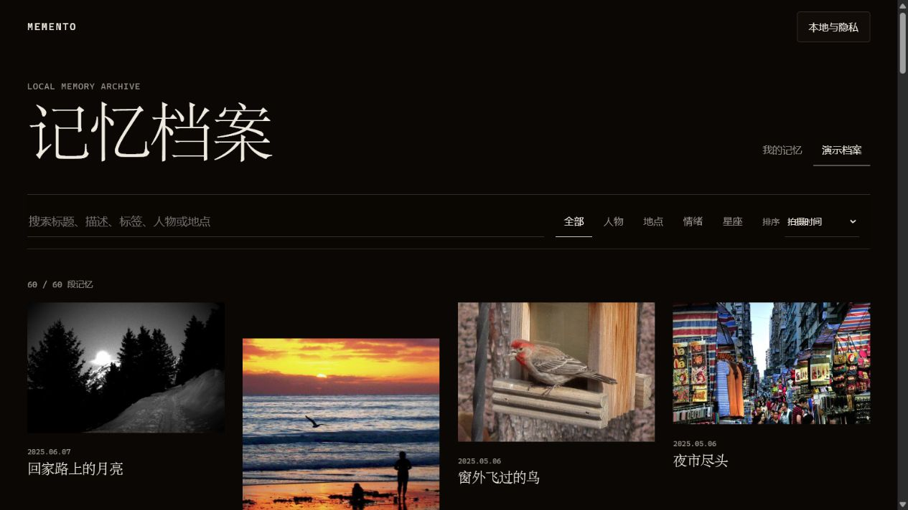
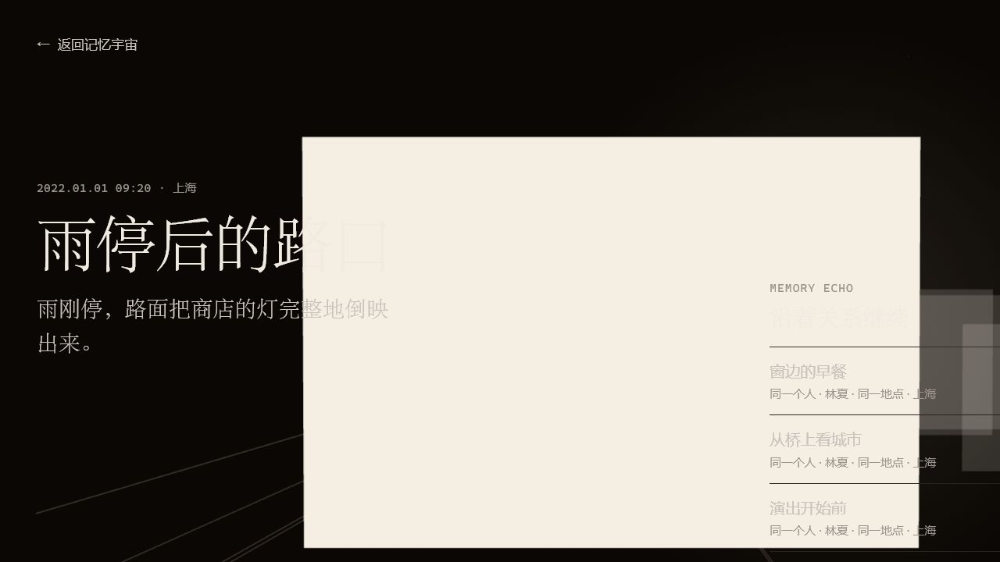

# Memory Universe｜AI 情感记忆宇宙

> AI-powered Emotional Memory Experience Platform

Memory Universe（记忆宇宙）不是普通相册，也不是单纯的视频播放器。它把照片、音乐、故事和空间关系组织成一次可以重新进入的情感记忆体验：用户可以从时间、人物、地点和情绪出发，在 3D 记忆宇宙中探索一段属于自己的过去。


## Live Demo

- 本地演示：`http://localhost:5173/universe?source=demo&demo=high-school`
- 公开地址：[GitHub Pages Demo](https://3555489035ppx-wq.github.io/memory-universe/)

打开演示不需要登录、不需要导入照片，也不需要音乐平台账号。它会加载 96 张内置 CC0 演示图片和一首本地 Demo 音轨，直接进入“那年夏天”高中回忆模板。

## 01｜项目介绍

Memory Universe 试图解决一个日常却容易被忽视的问题：我们拥有越来越多的照片，却很少真正重新体验照片背后的关系、情绪和故事。

产品将：

- 照片变成可探索的空间对象；
- 时间、人物、地点和情绪变成多种观察入口；
- 音乐成为情绪节奏，而不是播放器背景；
- 模板和 3D 动效把记忆组织成一段可播放的体验；
- 本地优先存储保证个人照片默认留在当前浏览器。

## 02｜项目背景与问题

传统相册擅长存储，却不擅长帮助用户重新理解记忆。线性时间轴会把照片变成一长串缩略图；文件夹只告诉用户文件放在哪里；视频剪辑又要求用户提前完成大量编排工作。

Memory Universe 的核心问题是：

> 如何让用户在不牺牲隐私的前提下，把散落的照片重新组织成具有关系、节奏和情绪的体验？

## 03｜产品目标

让用户能够：

1. 安全地导入并保留自己的照片与元数据；
2. 用时间、人物、地点、情绪和关系重新观察记忆；
3. 选择主题与音乐，生成一段可以播放的空间记忆；
4. 在关键节点进入单段记忆、创建星座或导出视频；
5. 在没有账号、没有网络或浏览器能力不足时仍能体验 Demo。

## 04｜用户体验流程


当前公开 Demo 以确定性模板引擎代替在线 AI，确保产品体验可以被复现；AI 内容组织的输入、上下文、输出和人工确认边界记录在 [`docs/USER_FLOW.md`](docs/USER_FLOW.md)。

## 05｜核心功能

### Memory Template

主题化的记忆播放结构。当前完整可体验的是“高中回忆”，恋爱、分手、大学、工作和自定义主题保留入口并标记为即将开放，不展示空白页面或假完成状态。

### Photo Timeline

基于照片时间、标题和上下文组织章节，并让照片在章节之间保持连续、可追踪的运动状态。

### Music Experience

支持本地音频播放、音量与节奏视觉；可选连接本机 MEMENTO Music Connector 获取网易云音乐 / QQ 音乐的真实可用音源。公开 Demo 默认使用内置 WAV，不要求登录。

### 3D Memory Space

使用 Three.js / React Three Fiber 表达空间关系、照片编排、相机移动和结尾粒子。时间、人物、地点、情绪是同一组记忆的不同观察方式。

### Story Experience

Memory Dive、Constellation 和模板章节让用户从“看照片”继续进入“理解这段记忆”。

### Backup & Export

个人数据可以导出为带校验的 ZIP 备份；视频导出提供 4K、1080P、横版与快速检查选项。远程音频不能伪装为可导出的本地音频，产品会明确提示用户。

## 06｜产品设计思考

### 为什么使用 3D？

3D 不是为了炫技，而是为了表达“靠近、远离、聚合、散开、关系强弱”等线性列表难以表达的状态。空间可以让用户在观察过程中自然地形成路径。

### 为什么结合音乐？

音乐提供连续的时间感和情绪密度。模板不是把照片按固定秒数轮播，而是让章节、相机和照片动效共同响应一条连续时间轴。

### 为什么需要 AI？

照片数量增长后，用户不可能手动为每张照片补齐人物、地点、情绪和故事。AI 的价值应在于提出组织建议，而不是替用户做不可逆决定。当前版本保留真实的 Human-in-the-loop（人在回路）设计边界，但暂未接入在线模型。

## 07｜技术实现

- 前端：React 19、TypeScript、Vite、React Router。
- 3D：Three.js、React Three Fiber、Drei、camera-controls。
- 状态：Zustand。
- 本地数据：IndexedDB、`idb`；照片处理在浏览器内完成。
- 图片处理：EXIFReader、pica、fast-average-color。
- 备份与导出：fflate、Mediabunny、本地音频物化流程。
- 测试：Vitest、Testing Library、Playwright；GitHub Actions 执行质量检查。
- AI 边界：当前公开 Demo 使用预设数据与确定性模板引擎，不虚构在线 AI 已接入。

## 08｜快速开始

```bash
pnpm install
pnpm dev
```

开发服务器默认访问 `http://localhost:5173/`，并会尝试启动只监听本机的 MEMENTO Music Connector。只需要 Demo 时，不需要登录音乐平台。

常用检查：

```bash
pnpm run lint
pnpm run typecheck
pnpm test
pnpm run build
```

## 09｜项目截图

| 入口与主页 | 记忆宇宙 | 档案管理 |
| --- | --- | --- |
|  |  |  |

| 记忆深入 | 星座创作 | Demo 素材 |
| --- | --- | --- |
|  |  |  |

## 10｜隐私与公开边界

个人照片、EXIF/GPS、衍生图片、备份和音乐登录会话不会随公开仓库发布。内置 Demo 使用 CC0 图片，并在 [`CREDITS.md`](CREDITS.md) 与 [`public/demo/demo-asset-credits.json`](public/demo/demo-asset-credits.json) 中保留来源记录。

详见 [`PRIVACY.md`](PRIVACY.md) 与 [`docs/PROJECT_ANALYSIS.md`](docs/PROJECT_ANALYSIS.md)。

## 11｜部署

项目包含 Vite 构建配置和 `vercel.json` 深层路由回退，可部署到 Vercel 或 Cloudflare Pages。完整发布步骤、环境变量边界、安全检查和上线验收见 [`docs/PUBLISHING_CHECKLIST.md`](docs/PUBLISHING_CHECKLIST.md)。

公开 Demo 不依赖本机音乐连接器；连接网易云音乐或 QQ 音乐属于可选的本地开发能力。

## 12｜Future Roadmap

- 接入可解释、可撤销的 AI 记忆组织流程。
- 完整实现恋爱、分手、大学、工作、自定义主题。
- 增加更多 3D 形态、空间叙事和无障碍动效控制。
- 支持跨设备加密备份与用户主动共享。
- 对导出性能、低端设备和移动端观看场景继续优化。

## 13｜项目文档

- [`docs/PROJECT_ANALYSIS.md`](docs/PROJECT_ANALYSIS.md)：当前状态、问题、风险和发布建议。
- [`docs/USER_FLOW.md`](docs/USER_FLOW.md)：产品流程、AI Flow、人工确认和失败状态。
- [`docs/PUBLISHING_CHECKLIST.md`](docs/PUBLISHING_CHECKLIST.md)：GitHub、Vercel、Cloudflare 和安全检查。
- [`PRODUCT.md`](PRODUCT.md)：产品定位与设计原则。
- [`ARCHITECTURE.md`](ARCHITECTURE.md)：工程结构与边界。
- [`CREDITS.md`](CREDITS.md)：依赖与 Demo 素材来源。
- [`PRIVACY.md`](PRIVACY.md)：本地数据与音乐连接器隐私边界。

## License

源码仓库发布前请补充最终许可证文件并确认第三方依赖、Demo 图片、音频与外部连接器的许可证边界。Demo 素材的 CC0 来源记录不代表整仓库自动采用 CC0。
