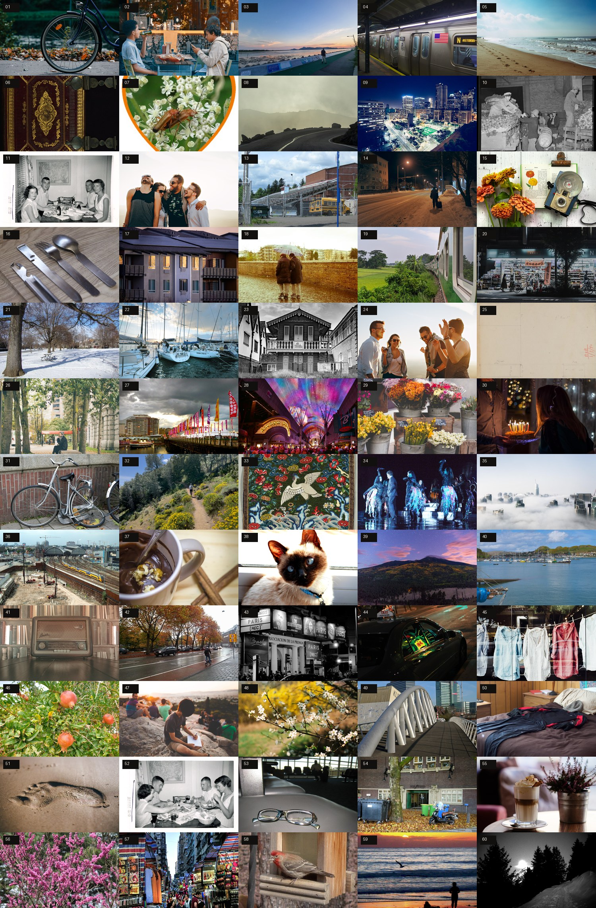
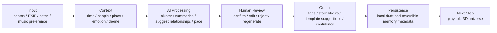

# Memory Universe

> AI-powered Emotional Memory Experience Platform.

Memory Universe is not a normal photo album or a video player. It turns photos, music, stories, and relationships into a memory experience that can be entered again: explored through time, people, place, and emotion, then replayed as a spatial story.

[Live Demo](https://memory-universe-two.vercel.app/) · [GitHub](https://github.com/3555489035ppx-wq/memory-universe)



## Live Demo

- 公开网址：<https://memory-universe-two.vercel.app/>

## Product Introduction

We take more photos than ever, but most photo libraries only answer “where is this file?”. They rarely help us revisit the relationship, mood, and story behind a memory. Memory Universe uses spatial relationships and a continuous music timeline to make the act of remembering feel exploratory rather than archival.

The product is Local First（本地优先）: personal photos, metadata, derived images, backups, and sessions stay in the current browser by default.

## User Problem

**Target users**

- People who want to revisit a meaningful period rather than scroll a timeline
- Families and individuals with growing personal photo libraries
- Privacy-conscious users who do not want to upload personal memories just to explore them

**Core problems**

1. A linear timeline turns meaningful photos into undifferentiated thumbnails.
2. Folders preserve files but not relationships, emotion, or narrative.
3. Creating a coherent memory video requires too much manual editing.
4. Online AI and music services can introduce privacy and availability concerns.

## Solution

Memory Universe combines:

- Theme-based memory templates
- Time, people, place, and emotion as different observation modes
- A 3D memory space for proximity, grouping, and movement
- Music as the emotional timeline rather than a background player
- Human confirmation for any future AI organization suggestion
- Local backup, recovery, and export boundaries

## Product Goal

Help a user move from scattered photos to a personal memory experience without giving up control of the original files:

```text
Choose a theme → Add memories → Choose music → Organize a story → Explore a 3D space → Dive deeper or export
```

## User Flow


## AI Workflow



The current public demo intentionally uses preset memory metadata, local images, a local soundtrack, and a deterministic template engine. Online AI is a future integration, not a hidden claim in the Demo.

## Core Experience

### High-school memory Demo · complete

The public route loads the **那年夏天** template with 96 built-in demo photos and a local audio track. It does not require login, photo import, or a music account.

Recommended 3-minute flow:

1. Open the [Live Demo](https://memory-universe-two.vercel.app/).
2. Click **体验高中回忆 Demo** and choose **高中回忆 / 那年夏天**.
3. Let the timeline enter the 3D memory space.
4. Switch between time, people, place, and emotion.
5. Open one memory, create a constellation, or replay the sequence.

### Other templates · Coming Soon

| Template | Status |
| --- | --- |
| 恋爱回忆 | Coming Soon · 功能开发中 |
| 分手回忆 | Coming Soon · 功能开发中 |
| 大学回忆 | Coming Soon · 功能开发中 |
| 工作回忆 | Coming Soon · 功能开发中 |
| 自定义主题 | Coming Soon · 功能开发中 |

These entries are documented as future scope and are not presented as empty, completed pages.

## Technical Implementation

- React 19, TypeScript, Vite, and React Router
- Three.js / React Three Fiber / Drei for spatial memory scenes
- Zustand for scene, template, music, and interface state
- IndexedDB for personal photos, EXIF, derived images, layouts, and backups
- EXIFReader, pica, and fast-average-color for browser-side image processing
- fflate and Mediabunny for backup and local export workflows
- Vitest, Testing Library, and Playwright for regression coverage

## Project Documents

- [Case Study](docs/case-study.md)
- [Product Story](docs/product-story.md)
- [User Flow](docs/user-flow.md)
- [Design Decisions](docs/design-decision.md)
- [Demo Script](docs/demo-script.md)
- [Project analysis](docs/PROJECT_ANALYSIS.md)
- [Privacy boundary](PRIVACY.md)
- [Publishing checklist](docs/PUBLISHING_CHECKLIST.md)

## Current Boundary

The complete public experience is the deterministic high-school memory Demo. Personal import, archive, backup, and export are real local flows; online AI organization, cross-device sync, sharing, and additional templates remain future work. This keeps the product story honest and gives future work a clear place to start.

## Local Development

Requires Node.js 20.19+ and pnpm 11.

```bash
pnpm install
pnpm dev
```

After the local server starts, use the development URL printed by Vite. Common checks:

```bash
pnpm run lint
pnpm run typecheck
pnpm test
pnpm run build
```

## Privacy and Asset Boundary

The public Demo assets are tracked with their source and license information in [`CREDITS.md`](CREDITS.md) and [`public/demo/demo-asset-credits.json`](public/demo/demo-asset-credits.json). Do not commit real personal photos, GPS/EXIF data, backups, tokens, or music sessions.

The repository does not yet declare a final open-source license. Confirm dependency, image, audio, and connector rights before reuse.
