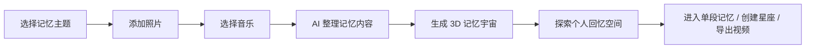
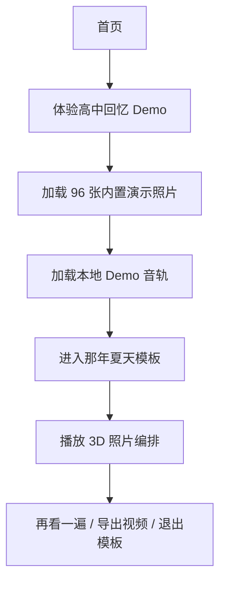
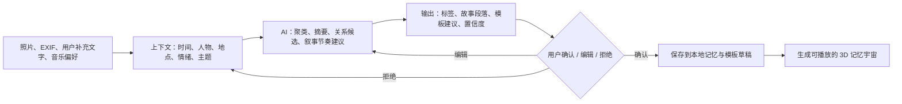

# Memory Universe 用户流程与 AI Flow

## 产品主流程

## 当前可直接体验的 Demo Flow

## AI Flow（当前边界）

当前公开版本没有调用在线大模型，必须把这一点写清楚：Demo 采用预设的记忆元数据、模板配置和确定性布局，保证无网络、无账号时也能展示完整产品闭环。

未来接入 AI 时，输入输出应保持可审计：

### Human-in-the-loop（人在回路）规则

- AI 只能提出人物、地点、情绪、关系和故事建议，不能静默改写用户原始照片或元数据。
- 用户可以逐项确认、编辑、拒绝和重新生成。
- AI 失败、结果不足或置信度低时，退回手动标签和预设模板，不阻塞照片浏览。
- AI 结果与原始照片分开保存，便于撤销和重新组织。

## 失败状态

| 状态 | 用户看到什么 | 下一步 |
| --- | --- | --- |
| 演示资源加载失败 | 兼容浏览模式或清晰错误提示 | 重试，不进入空白页 |
| 浏览器不支持 WebGL | 96 张演示照片的静态兼容布局 | 仍可浏览 Demo 或打开档案 |
| 音乐连接器离线 | 本地音频可用，远程连接明确失败 | 重试连接或选择本地音频 |
| 音频需要用户手势 | 播放按钮保持可用并提示一次点击 | 点击后启动，不要求重复点击 |
| 导出缺少本地音频 | 明确说明远程流不可写入导出 | 选择本地音频后重新导出 |
| AI 结果不足 | 保留原始内容并提供手动整理 | 用户确认后继续生成 |
