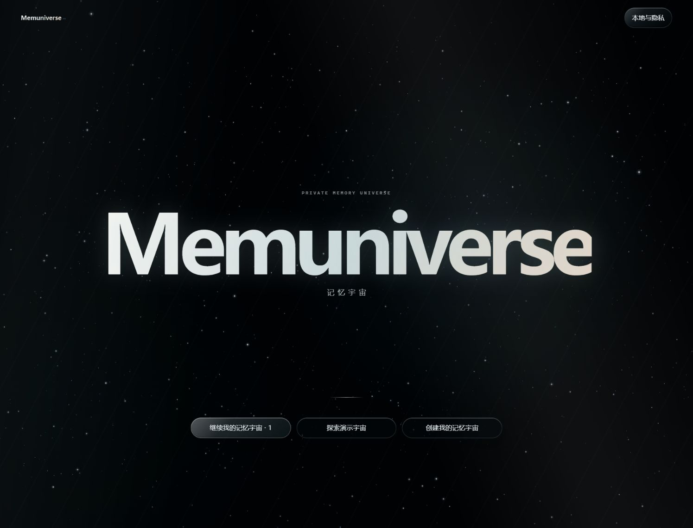
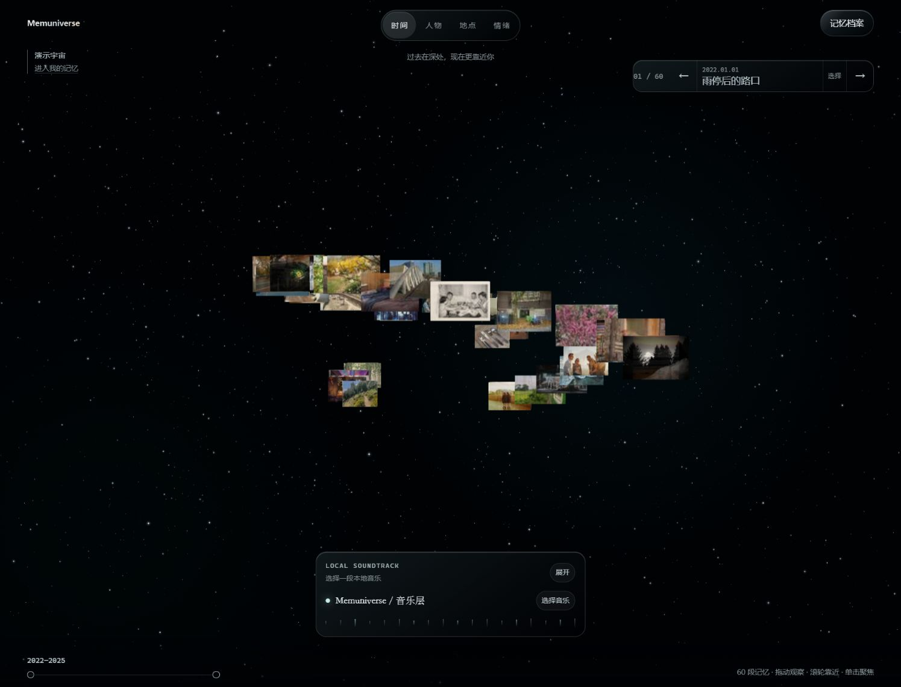

# Mineradio → Memuniverse comparison input

This review keeps each reference and its corresponding desktop implementation in one comparison surface.

| Reference | Memuniverse implementation |
| --- | --- |
|  |  |
|  |  |
|  |  |

Review outcome: the implementation matches the reference's black spatial atmosphere, centered brand launch, star density, and glass control language while keeping Memuniverse's real memory and local-audio flows.
