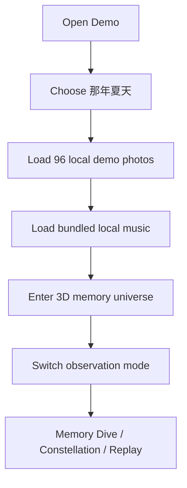
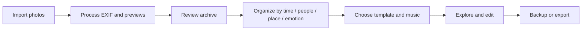

# Memory Universe User Flow

## Public Demo flow

## Personal flow

## Future AI contract

| Step | AI boundary | Human control |
| --- | --- | --- |
| Input | photos, EXIF, notes | choose what enters the flow |
| Context | time, people, place, emotion, theme | correct or remove context |
| Processing | cluster, summarize, suggest relationships and pacing | inspect confidence and source |
| Output | tags, story blocks, template suggestions | confirm, edit, reject, regenerate |
| Persistence | save AI metadata separately from originals | undo or reorganize later |

## Failure states

- WebGL unavailable: show a compatible static browsing mode.
- Demo asset load failure: keep a retry action and avoid a blank page.
- System music asset unavailable: show a clear retry/error state and keep browser upload available.
- Uploaded audio is removed or no longer readable: preserve the memory content and ask the user to choose another file.
- AI result insufficient: preserve original content and return to manual organization.
- Export lacks readable audio: explain why the selected system or uploaded file cannot be written into a local export.
